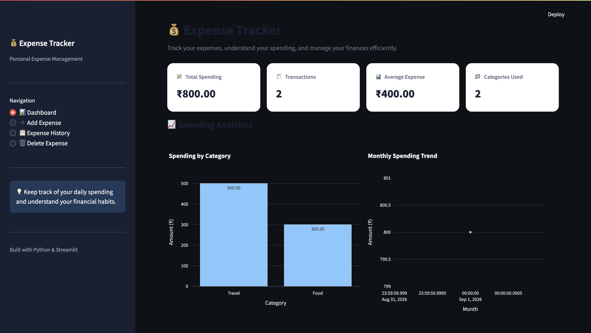

# 💰 Expense Tracker – Streamlit Web Application

A professional and user-friendly **Personal Expense Tracker** built using Python and Streamlit. This application helps users record, manage, analyze, and monitor their daily expenses through an interactive web-based dashboard.

The project uses CSV file storage for persistent expense management and Plotly for interactive data visualization.

---

## 📌 Project Overview

Managing daily expenses is essential for understanding spending habits and maintaining financial awareness.

The **Expense Tracker** provides a simple yet interactive interface where users can:

- Add new expenses
- View expense history
- Track total spending
- Analyze category-wise expenses
- Monitor monthly spending trends
- Delete unwanted expense records
- Download filtered expense data

This project demonstrates practical implementation of Python programming, data handling, validation, and web application development using Streamlit.

---

## ✨ Features

### 📊 1. Interactive Dashboard

- Displays total spending
- Shows total number of transactions
- Calculates average expense
- Displays the number of categories used
- Provides category-wise spending visualization
- Shows monthly spending trends

### ➕ 2. Add Expense

Users can record a new expense using a structured form.

**Input Fields:**
- Expense Date
- Category
- Amount
- Description

**Validation Includes:**
- Positive expense amount
- Valid expense description
- Category selection
- Future date restriction
- Maximum amount limit

### 📋 3. Expense History

Users can view and filter saved expenses.

**Features:**
- View expense records in a table
- Filter expenses by category
- Search by description
- Download filtered records as CSV

### 🗑️ 4. Delete Expense

- Select an expense using its ID
- Review the selected expense
- Confirm deletion before removing the record
- Update the CSV file after deletion

### 💾 5. CSV Data Storage

- Automatically creates the CSV file if it does not exist
- Stores expense records locally
- Loads existing expenses when the application starts
- Saves updates after adding or deleting expenses

---

## 🛠️ Tech Stack

| Technology | Purpose |
|------------|---------|
| Python | Application development |
| Streamlit | Web application interface |
| Pandas | Data manipulation and processing |
| Plotly | Interactive charts and visualization |
| CSV | Local data storage |
| pathlib | File path management |
| datetime | Date handling and validation |

---

## 📂 Project Structure

```text
expense-tracker-streamlit/
│
├── app.py
├── expenses.csv
├── requirements.txt
└── README.md
```

### File Description

| File | Description |
|------|-------------|
| `app.py` | Main Streamlit application |
| `expenses.csv` | Local expense data storage |
| `requirements.txt` | Required Python libraries |
| `README.md` | Project documentation |

> **Note:** `expenses.csv` is automatically created when the application runs if it does not already exist.

---

## ⚙️ Installation & Setup

### 1. Clone the Repository

```bash
git clone https://github.com/NehaKumari990/expense-tracker-streamlit.git
```

### 2. Navigate to the Project Directory

```bash
cd expense-tracker-streamlit
```

### 3. Create a Virtual Environment (Recommended)

```bash
python3 -m venv venv
```

Activate the virtual environment on macOS/Linux:

```bash
source venv/bin/activate
```

On Windows:

```bash
venv\Scripts\activate
```

### 4. Install Dependencies

```bash
pip install -r requirements.txt
```

Alternatively:

```bash
pip install streamlit pandas plotly
```

### 5. Run the Application

```bash
streamlit run app.py
```

The application will open in your browser.

Local URL:

```text
http://localhost:8501
```

---

## 🖥️ Application Workflow

```text
Start Application
       │
       ▼
Initialize CSV File
       │
       ▼
Load Expense Records
       │
       ▼
Display Streamlit Dashboard
       │
       ├── Add Expense
       │      └── Validate & Save
       │
       ├── Expense History
       │      └── Filter & Download
       │
       ├── Dashboard
       │      └── View Analytics
       │
       └── Delete Expense
              └── Confirm & Update
```

---

## 📸 Application Screenshots

### 📊 Expense Tracker Dashboard

The dashboard provides an overview of total spending, transactions, average expenses, and interactive spending analytics.



---

## 📊 Data Fields

The application stores the following fields:

| Field | Description |
|-------|-------------|
| `id` | Unique expense identifier |
| `date` | Date of the expense |
| `category` | Expense category |
| `description` | Description of the expense |
| `amount` | Expense amount in INR |

### Example Data

| ID | Date | Category | Description | Amount |
|----|------|----------|-------------|--------|
| 1 | 2026-09-20 | Food | Lunch | ₹150.00 |
| 2 | 2026-09-20 | Travel | Bus Ticket | ₹50.00 |
| 3 | 2026-09-19 | Education | Notebook | ₹120.00 |

---

## 📈 Analytics

The dashboard provides the following metrics:

### Total Spending

Calculates the sum of all recorded expenses.

### Average Expense

Calculates the average spending per transaction.

### Category-wise Spending

Uses a Plotly bar chart to visualize the total spending for each category.

### Monthly Spending Trend

Uses a Plotly line chart to display spending across different months.

---

## 🔒 Data Storage & Limitations

- Expense records are stored in a local CSV file.
- No user authentication is implemented.
- The application is designed for local or single-user usage.
- CSV storage is not intended for concurrent multi-user transactions.
- Data backups should be maintained separately.

---

## 🚀 Future Enhancements

The following features can be added in future versions:

- [ ] Edit existing expenses
- [ ] MySQL / SQLite database integration
- [ ] User authentication and login
- [ ] Date-range filtering
- [ ] Budget tracking and alerts
- [ ] Advanced financial analytics
- [ ] Downloadable reports
- [ ] Cloud deployment
- [ ] Multi-user support
- [ ] Income and expense comparison

---

## 🎯 Learning Outcomes

Through this project, I practiced:

- Python application development
- Streamlit UI design
- Pandas DataFrame operations
- CSV file handling
- Data validation
- Interactive data visualization
- CRUD-style expense management
- Project organization and documentation

---

## 🌐 Live Demo

🔗 **Streamlit App:** https://expense-tracker-app-9dbvnbcoqcdyctjnvfdoml.streamlit.app/

🔗 **GitHub Repository:**  
https://github.com/NehaKumari990/expense-tracker-streamlit

---

## 👩‍💻 Author

### Neha Kumari

B.Tech – Computer Science & Engineering (Data Science)

Aspiring Data Scientist | Machine Learning Enthusiast

**Connect with me:**

- GitHub: [NehaKumari990](https://github.com/NehaKumari990)
- LinkedIn: [Neha Kumari](https://www.linkedin.com/in/nehakumari1110/)

---

## 📄 License

This project is licensed under the MIT License.

See the [LICENSE](LICENSE) file for more details.

---

⭐ If you find this project useful, consider giving it a star on GitHub!
